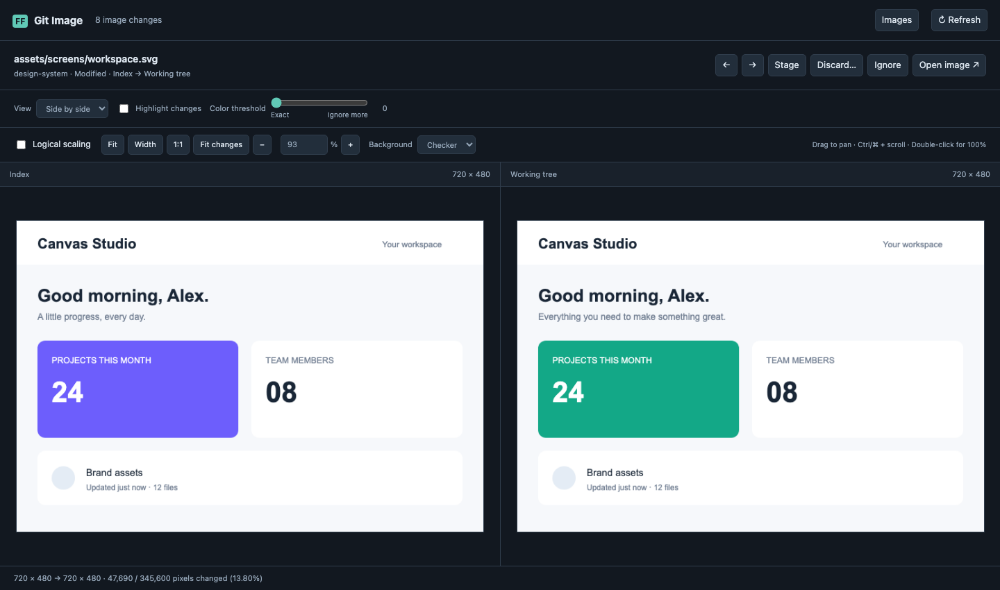
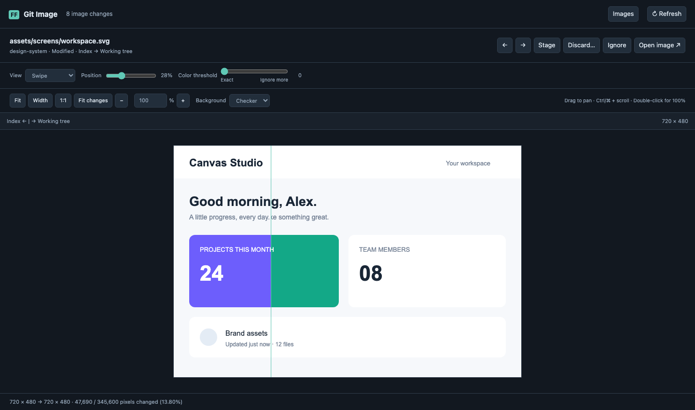
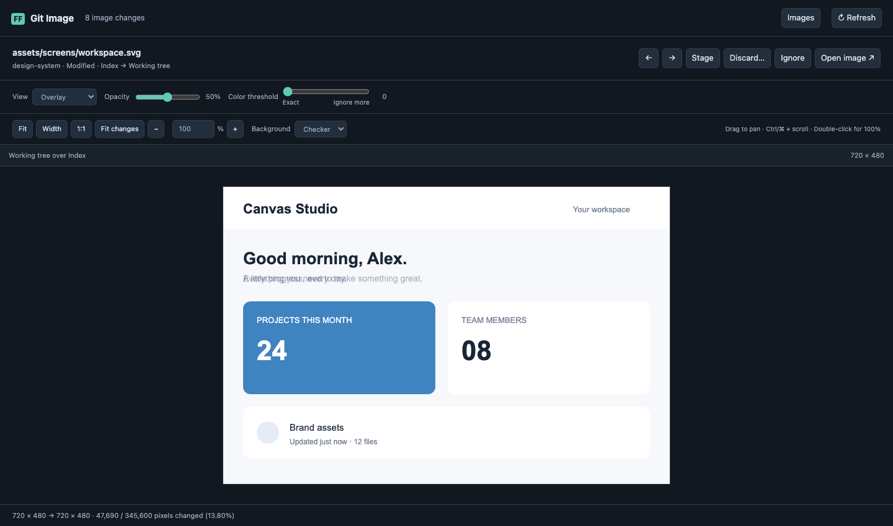
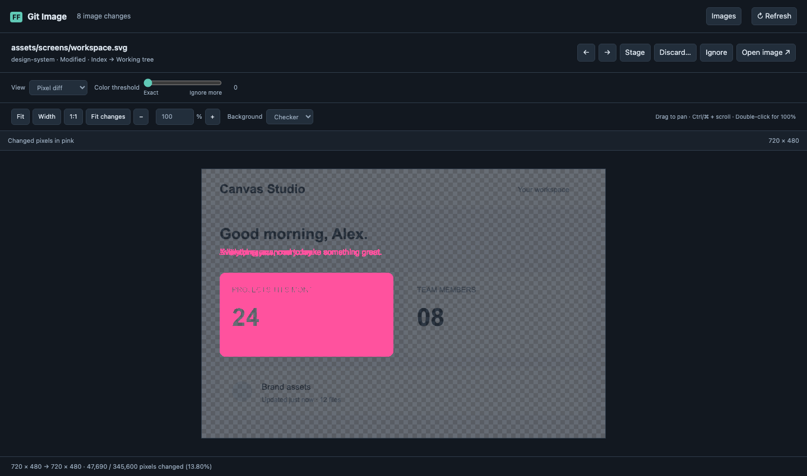
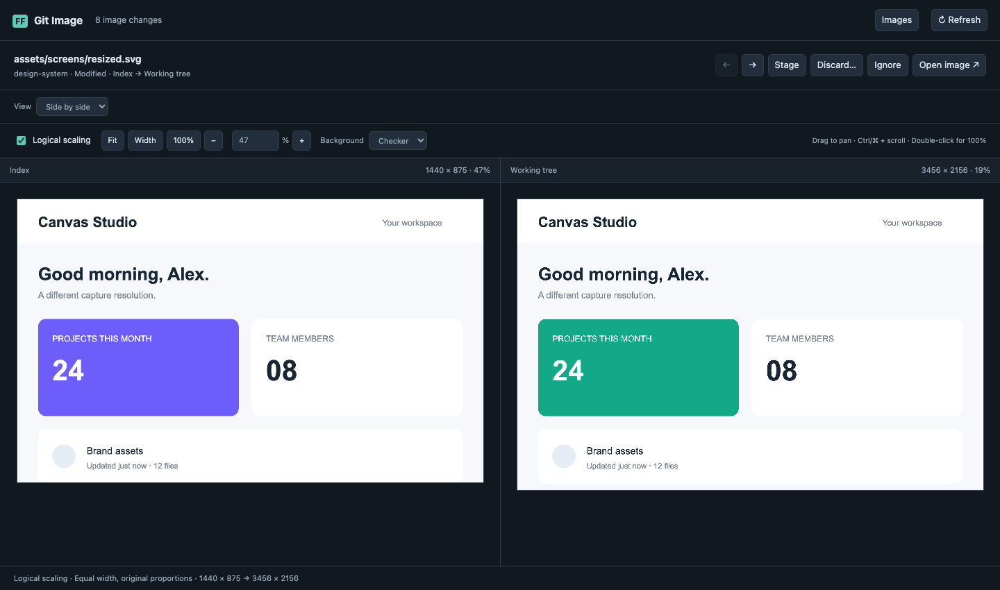

# FF Git Image


**See what changed in your images, right inside VS Code.**

Review screenshots, icons, illustrations, and other image assets in any Git repository. Pick a file in the native sidebar, compare its versions, and stage or discard changes without leaving the editor.

[Get started](#install-and-open) · [Comparison modes](#review-controls) · [Different image sizes](#compare-captures-with-different-dimensions) · [File actions](#accept-or-discard-a-folder) · [Changelog](CHANGELOG.md)

[](docs/images/side-by-side.png)

_Side by side: inspect both versions at once. Screenshots in this guide use demo images in the actual comparison interface._

- **Seven views:** Side by side, Swipe, Overlay, Pixel diff, Blink, Before, and After.
- **Different resolutions:** Logical scaling shows both screenshots at the same visual width.
- **Files and folders:** search changes, stage or discard a selection, and hide noise with [`.image_ignore`](#hide-images-with-image_ignore).
- **Keep your place:** synchronized pan and zoom, remembered settings, and background metrics that preserve the tree and its menus.

More from the same developer: [ASO.dev](https://aso.dev/) · [[FF] Flutter Files for VS Code](https://marketplace.visualstudio.com/items?itemName=gornivv.vscode-flutter-files).

FF Git Image is an independent extension for ordinary image assets in any Git repository. It has **no runtime npm dependencies** and does not require Flutter, Dart, ff_golden, ff_golden_presenter, ImageMagick, a browser server, or an external diff program.

## Install and open

Download a tagged build from [GitHub Releases](https://github.com/asodevapp/ff_git_image/releases), or [build a VSIX locally](#development). Branch and PR builds are available as temporary artifacts under [GitHub Actions](https://github.com/asodevapp/ff_git_image/actions).

1. Install the `.vsix` using **Extensions → … → Install from VSIX…**.
2. Open a Git repository in VS Code with the built-in Git extension enabled.
3. Click **FF Git Image** in the Activity Bar (the vertical icon strip). The sidebar groups images by repository and staged/unstaged changes, then by folder; click an image to open its comparison.

The sidebar header has **Find Changed Image** (search icon), **Open Image Changes**, and **Refresh** actions. Search by filename, full path, repository, or staged/unstaged state; selecting a result opens that comparison and reveals its tree entry. You can also run **[FF] Git Image: Find Changed Image** or **[FF] Git Image: Open Image Changes** from the Command Palette, or click the diff icon in the Source Control header.

Single-child folder chains are compacted into one row. Branches such as `dark/en`, `dark/ru`, `light/en`, and `light/ru` keep repeated image names distinguishable. Folders show their changed-image count, and file tooltips show the full path, rename source, and comparison scope. Opening an image from the tree keeps focus in the sidebar for keyboard navigation; folder and file identities remain stable across Git refreshes.

You can also right-click an image in Explorer or Source Control and choose **[FF] Git Image: Compare Image Changes**, or use its editor title action. The native sidebar is the only file list. The editor tab uses its full width for the comparison; its **Images** button reveals the sidebar if it is hidden.

## Review controls

| View           | Behavior                                                         |
| -------------- | ---------------------------------------------------------------- |
| Side by side   | Before and after with synchronized scrolling and zoom            |
| Swipe          | Reveal either version using the slider or drag the dividing line |
| Overlay        | Blend the new version over the old with adjustable opacity       |
| Pixel diff     | Changed pixels in pink over a faded image                        |
| Blink          | Alternate frozen versions every 650 ms                           |
| Before / After | Inspect one version at a time                                    |

### Swipe and overlay

| Swipe                                                                                                                    | Overlay                                                                                                                              |
| ------------------------------------------------------------------------------------------------------------------------ | ------------------------------------------------------------------------------------------------------------------------------------ |
| [](docs/images/swipe.png) | [](docs/images/overlay.png) |
| Drag the divider across a detail to reveal the old and new versions.                                                     | Adjust opacity to spot moved edges and overlapping content.                                                                          |

Click a screenshot to inspect it at full size.

### Pixel diff and color threshold

[](docs/images/pixel-diff.png)

Pink marks the changed pixels. Start at **Exact** to see every difference; move **Color threshold** toward **Ignore more** to filter out smaller color variations. This changes the comparison preview; tree percentages always use Exact.

### Pan, zoom, and review

- **Highlight changes** adds a pink mask to the after image in side by side and after modes; **Intensity** controls its opacity and is remembered.
- **Logical scaling**, directly above the images in Side by side, displays both versions at equal width while preserving proportions and top alignment. Uncheck it to return to original pixel sizes. The checkbox is remembered across files and tab restoration.
- **Color threshold** is a slider from **Exact** to **Ignore more**. Move right to ignore larger differences in color and transparency; the small readout shows the threshold (0–255). Drag updates are grouped to keep comparison responsive, and the value is remembered. Arrow keys adjust by one; Home resets to Exact. A changed image extent always counts as a change, even if transparent. Tree percentages continue using Exact.
- **Fit**, **Width**, **1:1**, **Fit changes**, **+/−**, and an editable percentage (1–1600%) control zoom. Double-click the image to toggle Fit/100%. Outside controls, `+`/`−`, `0`, and `1` zoom, fit, or select 100%. Drag to pan; Ctrl/Cmd + scroll zooms around the pointer. At 200% and above, pixels use nearest-neighbor display.
- Choose checkerboard, dark, or light backgrounds to inspect transparency.
- Select images in the native sidebar, grouped by repository, staged/unstaged scope, and folder. Use the tree's standard keyboard navigation or the search icon to find an image by path.
- Git state and image file changes refresh the tab automatically. The comparison updates only when either image's contents change; unrelated updates preserve the view, zoom, and scrolling. **Refresh** explicitly updates Git status.
- View settings and the selected image are restored when VS Code recreates the tab.

### Compare captures with different dimensions

[](docs/images/logical-scaling.png)

_Different pixel dimensions, matching visual width. Compare the layout and content while both original sizes remain visible._

Choose **View → Side by side** and check **Logical scaling** above the images, next to Fit. Each version uses its own image-sized canvas. Both versions have the same displayed width, preserve their aspect ratios, and align at the top. Zoom and scrolling stay synchronized in the shared visual coordinates. For example, 1440 × 875 and 3456 × 2156 captures fill the same visual width instead of leaving the smaller version in the corner of a larger canvas.

This setting is intended for comparing content and layout across different screenshot resolutions. **Fit** fits the whole pair; **100%** displays both at the smaller image's native width. Each pane shows its original dimensions and actual image scale. Pixel highlight, color threshold, change bounds, and raw pixel percentages are hidden while logical scaling is active because they describe the original pixel grid. Uncheck the box to restore them. Other views continue using original pixels; returning to Side by side restores the checkbox's selection. Saved settings from the former Layout view automatically migrate to Side by side with Logical scaling checked. Images are not stretched, cropped, or modified; no automatic semantic matching is performed.

## Git semantics

### Hide images with .image_ignore

Create `.image_ignore` in the root of each Git repository to hide images from FF Git Image:

```gitignore
# Hide high-resolution variants and generated images
**/*@2x.png
src/assets/images/generated/

# Keep one exception to a filename pattern
*.preview.png
!important.preview.png
```

Patterns use [Git ignore syntax](https://git-scm.com/docs/gitignore#_pattern_format): one per line, `#` comments, `*`, `?`, `**`, character ranges, directory rules ending in `/`, root-anchored paths starting with `/`, and `!` exceptions. Matching is case-sensitive. If a parent directory is excluded, re-include the directory before re-including a file inside it.

The working copy of the root `.image_ignore` applies to **all** image changes in that repository, including tracked, staged, deleted, and conflicted files. Renames match their destination path. Nested `.image_ignore` files are not read. Rules affect the extension's tree, search, counts, and comparison list; they do not modify files, `.gitignore`, the Git index, or Source Control visibility.

Saving, creating, or deleting the file updates the extension automatically, and **Refresh** rereads it. Each repository has independent rules. If the selected comparison becomes excluded, the viewer selects another visible image or displays an empty state. If the file cannot be read, a warning is shown and the previous rules remain active until it can be read again.

### Manage exclusions from the tree

Use **Ignore Images** on files, folders, or a multi-selection. The extension appends exact, escaped paths to `.image_ignore` and preserves comments and existing rules. A folder adds its current selected image paths, not a wildcard for future files. **Show Ignored Images** in the sidebar overflow menu reveals excluded entries; **Stop Ignoring Images** appends the necessary exceptions, including excluded parent directories, while keeping their other images hidden. The visibility toggle is remembered per workspace. Save any unsaved `.image_ignore` edits before using these actions. The ignore file is never staged automatically.

### Compared versions

| Group                     | Before             | After                      |
| ------------------------- | ------------------ | -------------------------- |
| Staged                    | HEAD               | Index                      |
| Unstaged                  | Index              | Working tree               |
| Untracked / intent to add | Not present        | Working tree               |
| Merge conflict            | HEAD, if available | Working tree, if available |

A partially staged file has **two separate entries**. Renames use the old path for the before version and the new path for the after version. New images open at full width with a **new** badge, without an empty before pane. Zoom, pan, backgrounds, and file actions remain available; comparison controls return with your saved settings when you select a modified image. Deleted files retain an explicit absent after side. Merge conflicts remain marked as conflicts; this extension does not resolve them.

### Accept or discard a folder

Right-click an image, folder, or scope heading in the FF Git Image tree:

- **Accept Image Changes (Stage)** in Changes stages the selected images, including additions and deletions.
- **Unstage Image Changes** in Staged Changes removes those changes from the index and preserves working files.
- **Discard Image Changes…** in Changes shows the exact image list for confirmation, restores tracked images to the index version, and moves new images to Trash. A partially staged file retains its staged changes. To discard staged changes too, first unstage them and then discard the resulting Changes entry.

Folder and group actions include only their visible image descendants, respecting `.image_ignore`. Other files, sibling folders, and hidden images are untouched. A rename includes both its old and new names when staging or unstaging. Filenames with brackets, spaces, and Unicode are addressed literally. Changes made while the discard dialog is open cancel the operation so they can be reviewed again. Symbolic links and directories replacing image files are not modified.

Ctrl/Cmd-click or Shift-click to select several files and folders. Right-clicking a selected row applies to the selection; right-clicking a different row applies to that row. Overlapping folders/files are deduplicated. Stage handles unstaged, non-ignored entries; Unstage handles staged, non-ignored entries. Commands from the tree and comparison toolbar share one FIFO queue. One progress notification shows the current action and the number waiting. Identical outstanding commands for the same selected revisions share a task. Each task keeps the paths and revisions captured when clicked, checks them again before writing, and reports the completed count. A failed task or a cancelled discard confirmation does not block later tasks. Conflicting commands whose selected changes are no longer current are rejected; queued selections are never silently expanded or updated.

Image contents are fingerprinted as the tree loads. Tree actions remain available during background calculations; if a selected image is still loading, the operation waits for its initial revision and reports progress. A changed path with unchanged Git status is still rejected. For an image already viewed, the last displayed revision must also match. If a file changes, review the refreshed image before trying again. Preview errors and preview size limits also prevent Git mutations through this UI; use Source Control for those files.

The comparison toolbar offers **Stage / Unstage**, **Discard…**, **Ignore / Stop ignoring**, **Previous**, and **Next**. Left/right arrows navigate images when focus is outside controls and reveal the current image in the native tree. Navigation remains available while actions are running, so another image can be reviewed and queued. Only the image with an outstanding toolbar action has its action buttons temporarily disabled.

Commands refresh Git status only in the selected repositories. Initial reads needed by an action take priority over queued background images; background revision checks and pixel-statistics requests pause during the operation and resume afterward. The tree and comparison refresh after each action, with background fingerprint work outside the mutation queue. Committing and conflict resolution remain in VS Code's Source Control. Discard uses VS Code's filesystem API; if the filesystem cannot move a new image to Trash, the error is reported without silently retrying permanent deletion.

### Git index lock recovery

If staging or unstaging fails specifically because `index.lock` exists, choose **Retry**, **Open Git Log**, or **Remove index.lock…**. Removal needs a second confirmation that Git operations have been stopped. The extension verifies the reported path against the repository's Git directory, including linked worktrees, rejects symlinks, and rechecks the lock identity and timestamps after confirmation. A replaced or changed lock is preserved. It never deletes a lock automatically based on age or starts `lsof`/shell commands. The extension cannot prove another process is idle; stop Git operations in other clients before confirming. The selected image revisions are checked again before one retry.

### Pixel percentages in the tree

Once a comparison tab is open, its local background worker calculates original-pixel differences sequentially for visible images and sends only counts back to the tree. This does not change the active canvases, zoom, or comparison mode. Unchanged Git status notifications preserve the existing tree nodes and revisions. Percentages use native file decorations, separate from tree structure updates, so background results do not reset context menus or selection. The compact badge shows a whole percentage (`0`, `<1`, `1`–`99`, or `Δ` for 100%); hover for the exact percentage and partial folder counts. `…` means pending and `!` means unavailable. File percentages and pixel-weighted folder percentages are cached by image revision, and only affected ancestor totals change. Values use Exact and original dimensions, independently of logical scaling and the current viewer color threshold. Closing the tab pauses remaining computation; reopening resumes it.

Fingerprints, previews and background statistics share an in-memory cache with a 64 MiB byte budget and up to 2,000 recently used fingerprints/results. Working-file events invalidate exact paths even when timestamps are preserved. Git index metadata is checked via literal blob paths when the real index changes (including linked worktrees); immutable commit versions remain reusable. Image bytes are read again only for changed or evicted versions, and unchanged snapshots do not reload the viewer. Explicit Refresh bypasses preview caches and retries unavailable results. Stage, Unstage and Discard always verify fresh bytes independently of this cache.

## Formats and limits

Supported extensions: **PNG, JPG/JPEG, WebP, GIF, BMP, SVG, ICO, AVIF**, including uppercase extensions. Decoding uses VS Code's Chromium engine. TIFF, HEIC, PSD, RAW, and other formats requiring additional codecs are not supported.

- Animated images are frozen to a decoded frame; animation timelines are not compared.
- SVG is rendered at its intrinsic size, as an image, with external resources disabled by the browser's image context. This is a raster comparison, not an SVG source diff.
- Previews are limited to **32 MiB per file**, **16 million pixels in the combined comparison area**, and **16,384 pixels per dimension**.
- Git LFS pointers display an explanation; the extension does not fetch LFS content. A readable working copy can still be previewed. Discard LFS images through Source Control so its LFS filters can restore the working file; FF Git Image never replaces it with the raw pointer.
- Unsupported, corrupt, oversized, and unreadable versions display errors. Pixel statistics are withheld when either required version fails to load.
- Pixel counts describe decoded browser RGBA values, including alpha. They are a visual review aid, not a perceptual test threshold or a golden-test verdict.

Requires VS Code 1.85+ and its built-in Git integration with Git available. VS Code's Git extension manages Git processes; FF Git Image itself does not start external programs, HTTP servers, or shell commands. Remote extension hosts are supported by the architecture but have not yet been separately verified; virtual workspaces are not supported.

## Development

Use Node.js 22+ for the development tools.

```sh
npm ci
npm test
npm run package
```

Open this folder in VS Code and press **F5** to launch an Extension Development Host. Build output is in `out/`; `npm run package` creates `ff-git-image-<version>.vsix`. The manifest uses `ff-git-image` because VS Code package names cannot contain underscores; the repository is `ff_git_image`.

Additional verification:

```sh
npx playwright install chromium
npm run test:ui
npm run test:host
```

The browser test uses an ephemeral loopback server and synthetic image fixtures, checks canvas pixels and interactions, and saves a screenshot under `.test-host/`. These tools are used only for development and are excluded from the VSIX. The host test launches an isolated installed VS Code against a temporary Git repository and checks the real Git filesystem provider. On macOS it discovers the standard application path; elsewhere set `VSCODE_EXECUTABLE` to the VS Code executable (the Electron executable, rather than a detached CLI launcher).

Implementation: TypeScript extension host, a local HTML/CSS/JavaScript webview, and a local Web Worker for pixel comparison. Image bytes travel through VS Code's message channel; workspace paths never enter HTML. The webview can load code and styles only from its packaged media directory and has no network permissions.

The integration uses the [built-in Git API v1](https://github.com/microsoft/vscode/blob/main/extensions/git/src/api/git.d.ts) and the [VS Code webview API](https://code.visualstudio.com/api/extension-guides/webview).

To regenerate the five README screenshots from the current webview and synthetic fixtures:

```sh
node test/ui.mjs --screenshots
```

This runs the browser checks and saves the gallery to `docs/images/`. It does not capture your workspace or start any tools in the installed extension.

## Releases and publishing

Pushing a version tag such as `v1.0.0` runs the shared checks, builds a VSIX, and publishes it with `SHA256SUMS` and changelog notes to [GitHub Releases](https://github.com/asodevapp/ff_git_image/releases). The tag must match the package and changelog versions. Branch and pull request builds stay in Actions artifacts for 14 days.

See the [publishing guide](docs/PUBLISHING.md) for the first release, version updates, retry behavior, and Marketplace setup.

## Related projects and links

| Project                | What it does                                                                                              | Links                                                                                                                                                                        |
| ---------------------- | --------------------------------------------------------------------------------------------------------- | ---------------------------------------------------------------------------------------------------------------------------------------------------------------------------- |
| **ASO.dev**            | App Store optimization and store management: keywords, metadata, localization, screenshots, and releases. | [Website](https://aso.dev/) · [Screenshot tools](https://aso.dev/metadata/editor-screenshots/)                                                                               |
| **[FF] Flutter Files** | Scaffold Flutter BLoC files and project templates directly in VS Code.                                    | [Install from Marketplace](https://marketplace.visualstudio.com/items?itemName=gornivv.vscode-flutter-files) · [Source code](https://github.com/Gorniv/vscode-flutter-files) |

For FF Git Image, see the [source code](https://github.com/asodevapp/ff_git_image), [report a bug or request a feature](https://github.com/asodevapp/ff_git_image/issues), or browse the [changelog](CHANGELOG.md).

## License

MIT. See [LICENSE](LICENSE).

Git ignore pattern matching uses a bundled copy of [ignore 7.0.6](https://github.com/kaelzhang/node-ignore), also MIT licensed. Its source attribution and license are included in `vendor/ignore/` and the VSIX. A small compatibility patch preserves escaped literal question marks in ignore rules. No runtime npm installation is needed.
